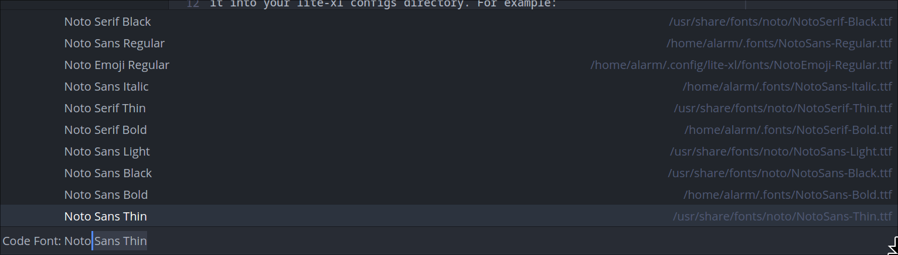

# lite-xl-fontseek

A cross-platform font searching and loading plugin solution for Lite XL.

This project is the start (experiment) of a support library that facilitates
searching and loading fonts without having to rely on external dependencies like
font-config. To achieve this a font meta data parser [written in Lua] is used to
generate a list of fonts with details like `family` and `subfamily`. This list
is later cached into a persistent file storage that can be quickly loaded on
each session startup for easy font lookups.

[written in Lua]: https://gist.github.com/zr-tex8r/1969061a025fa4fc5486c9c28460f48e

## Installation

To install clone this repository to your user directory as shown below. Also
make sure to clone to the right directory name which is `fontseek`.

```sh
cd ~/.config/lite-xl/
git clone https://github.com/jgmdev/lite-xl-fontseek plugins/fontseek
```

## Usage

For the moment it allows searching and loading multiple fonts into a font group.
The following interface provides functionality to load multiple fonts:

```lua
---@alias FontInfo.style
---|>'"regular"'
---| '"bold"'
---| '"italic"'
---| '"bold italic"'
---| '"thin"'
---| '"medium"'
---| '"light"'
---| '"black"'
---| '"condensed"'
---| '"oblique"'
---| '"bold oblique"'
---| '"extra nold"'
---| '"Extra bold italic"'
---| '"bold condensed"'

---@class plugins.fontseek.font
---@field public name string
---@field public style FontInfo.style
---@field public monospaced boolean
---@field public options renderer.fontoptions

---Search for fonts and loads them it into the given table field.
---@param t table A table where the font resides
---@param field string Name or idx where the font is stored
---@param fonts_list plugins.fontseek.font[] List of fonts to search and load
---@param size number Desired overall font size without SCALE applied
function fontseek.load(t, field, fonts_list, size) end
```

### Example Usage

```lua
local fontseek = require "plugins.fontseek"

-- font options
local options = { antialiasing = "subpixel", hinting = "slight" }

-- Load the fonts without having to know the path or exact file name.
-- this may not work perfectly, who knows :) ...
fontseek.load(style, "font", {
  { name = "open sans", style = "regular", options = options },
  { name = "emoji", options = options }
}, 16)

fontseek.load(style, "code_font", {
  { name = "noto sans", style = "medium", monospaced = true, options = options },
  { name = "emoji", options = options },
  { name = "nonicons", options = options },
}, 15)
```

## Extras

Besides providing a basic api that lets you load your fonts it also adds
commands that allow you to swap the current text and code fonts from an
"easy to search" `CommandView` list:



## Commands

* `font-seek:set-code-font` - change the size and font of code
* `font-seek:set-text-font` - change the size and font of other text
* `font-seek:rebuild-cache` - re-generate the font cache

## Future Plans?

Expand the functionality provided (if needed) to implement a basic font picker
dialog for the [widgets](https://github.com/lite-xl/lite-xl-widgets) library.

## Technical Details and Possible Drawbacks

The first time the plugin loads will scan all your system available plugins.
With 3000+ font files it takes around 1.5 seconds, when done within the context
of a coroutine to prevent startup block it can take from 3 to 5 seconds. This
isn't bad taking into consideration that Lua is parsing all the 3000+ font
files metadata.

The slow part is the second stage, which is to identify if a font is monospaced
or not. This is because we need to load the font glyphs and compare the width
from at least one character to another. We are also performing this task in the
context of a coroutine and with the 3000+ fonts figures this takes 60+ seconds
to complete.

After the above two stages we cache the list of fonts by storing it into a
serialized Lua table. Loading this Lua table with the 3000+ fonts is basically
performed instantly by Lua, so caching boosts subsequent startups while giving
immediate lookup access to the list of installed fonts.
